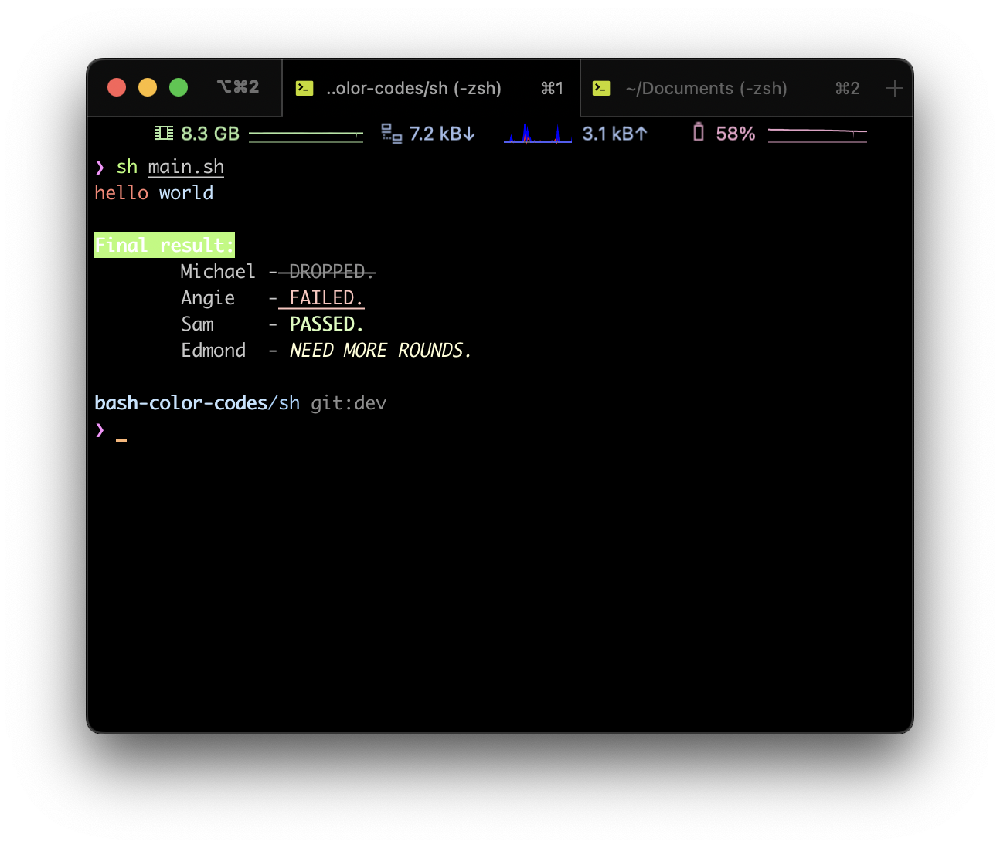
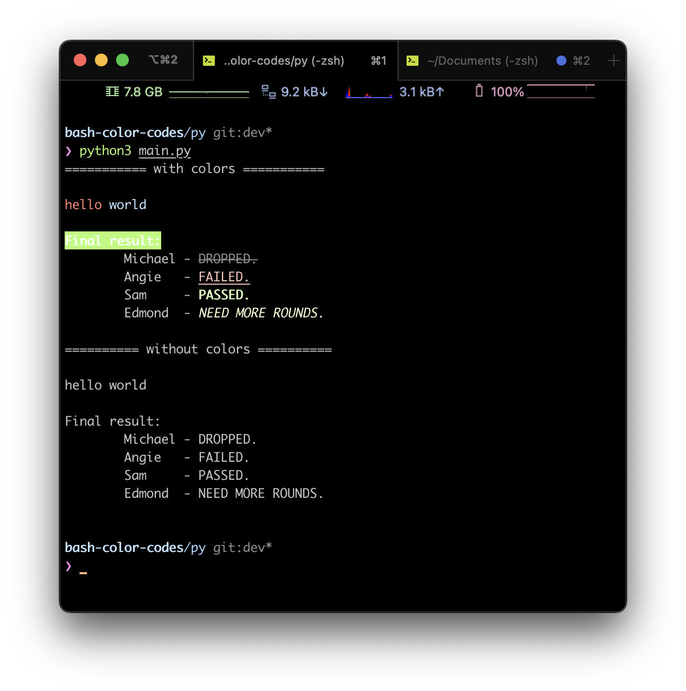

# Shell color codes

## about

- This repo contains sample Shell color codes for Python and Shell script.
- It describes how to display texts in colors in Terminal (Shell).
- This has been written to support blogs below.

## blog related

- [EN] [Paint Terminal with Shell color codes](https://www.bluebirz.net/en/Shell-color-codes/)
- [TH] [แต้มสีให้ Terminal ด้วย Shell color codes](https://www.bluebirz.net/th/Shell-color-codes-th/)
- [Medium] [Paint Terminal with Shell color codes](https://medium.com/@bluebirz/paint-terminal-with-bash-color-codes-4d57a57e634c)

## How to run

### Bash script

```bash
cd sh
sh main.sh
```



### Python

```bash
cd py
python3 main.py
```



## Credits

1. How do I print colored text to the terminal? <https://stackoverflow.com/questions/287871/how-do-i-print-colored-text-to-the-terminal>
2. Replace non-printable characters in perl and sed <https://unix.stackexchange.com/a/201753>
